# TaskFlow: Event-Driven Azure Multi-Service Cloud Application

<div align="center">


</div>

---

## Student Information

| Field | Value |
|-------|-------|
| **Name** | Afnan Ahmad Baig |
| **Roll Number** | 27100206 |
| **GitHub Repository** | https://github.com/Afnan27100206/CS487-PA4 |
| **Resource Group** | `rg-sp26-27100206` |
| **Region** | `ukwest` |
| **Submission Date** | May 2026 |

---


# Task 1: App Service Web App (15 points)

## Evidence 1.1: Forked Repository

**GitHub Repository:** https://github.com/Afnan27100206/CS487-PA4

Working fork of the CS487-PA4 starter repository. Contains the full project structure with `function-app/`, `validate-api/`, `report-job/`, and `webapp/` directories, all ready for containerization and deployment to Azure.

---

## Evidence 1.2: App Service Overview

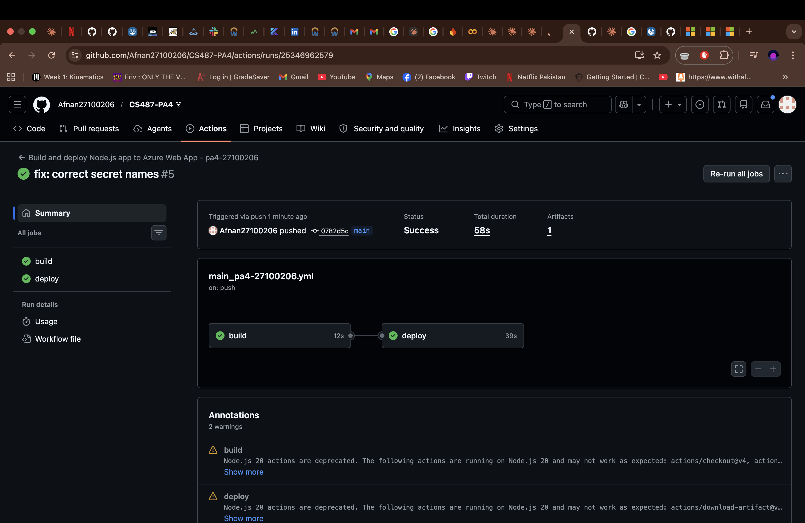

Web App `pa4-27100206` deployed to resource group `rg-sp26-27100206` in UK West region, running Node.js 22 LTS on Linux. Public URL: `https://pa4-27100206.azurewebsites.net/`

---

## Evidence 1.3: GitHub Actions CI/CD

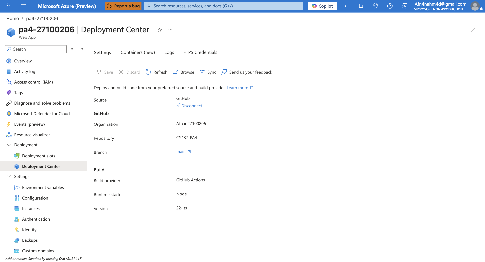

Deployment Center connected to GitHub repository with automatic deployment on every push to the `main` branch. GitHub Actions workflow pulls from the starter repository, builds the Node.js frontend, and deploys to App Service.

---

## Evidence 1.4: Live Web Application

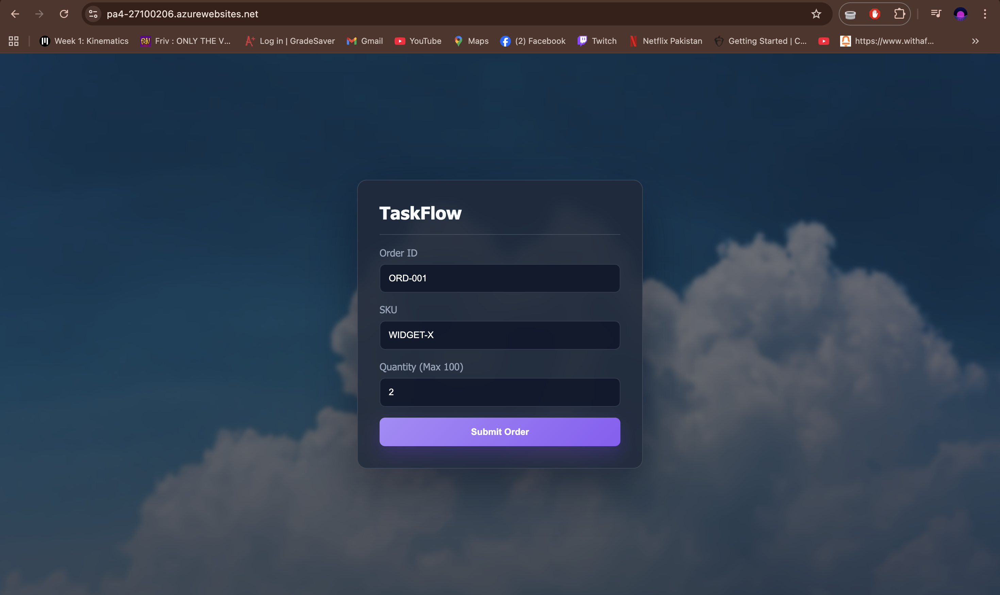

TaskFlow order submission form is live and accessible at `pa4-27100206.azurewebsites.net`. The frontend UI successfully loads and displays the order entry interface, confirming that App Service is serving static and dynamic content correctly.

---

# Task 2: Azure Container Registry (15 points)

## Evidence 2.1: ACR Overview

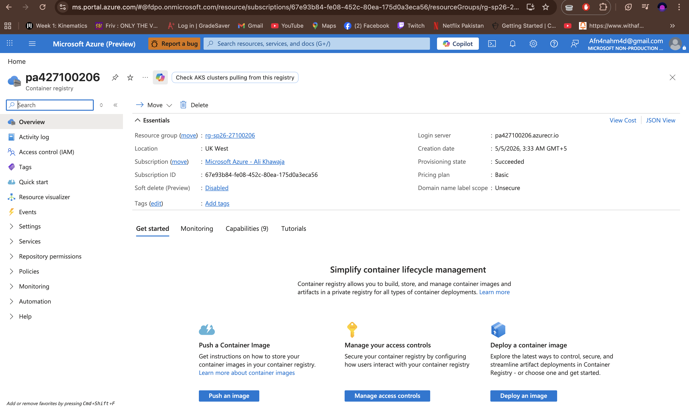

Container Registry `pa427100206` provisioned in resource group `rg-sp26-27100206`, UK West region, with Basic SKU tier and admin user enabled for authentication. Registry name: `pa427100206.azurecr.io`

---

## Evidence 2.2: Docker Image Builds

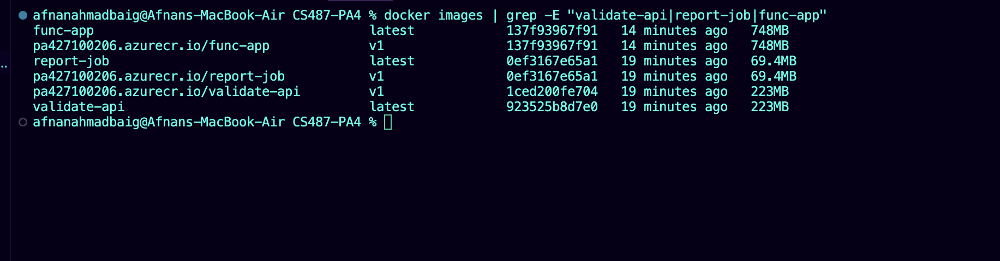

Successful local Docker builds for all three application components using the `--platform linux/amd64` flag:
- `validate-api` from `validate-api/` directory
- `report-job` from `report-job/` directory  
- `func-app` from `function-app/` directory

All images built and ready for push to ACR registry.

---

## Evidence 2.3: ACR Repositories

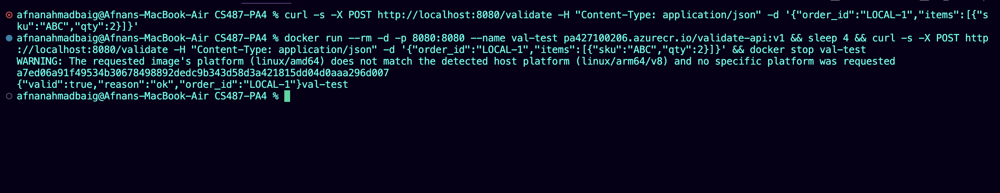

All three image repositories successfully pushed to ACR and visible in the portal:
- `pa427100206.azurecr.io/validate-api:v1`
- `pa427100206.azurecr.io/report-job:v1`
- `pa427100206.azurecr.io/func-app:v1`

Each repository contains tagged versions ready for deployment to Function App, AKS, and ACI.

---

# Task 3: Durable Function Implementation (12 points)

## Evidence 3.1: Durable Orchestration Code

**Source File:** [function-app/function_app.py](function-app/function_app.py)

Complete Durable Functions orchestration implementing the event-driven workflow:

- **`http_starter`**: HTTP-triggered entry point that starts the orchestration and returns 202 status with polling URI
- **`my_orchestrator`**: Orchestration function that chains activities in sequence
- **`validate_activity`**: Calls the AKS validator service via HTTP POST; returns `{"valid": bool, "reason": str}`
- **`report_activity`**: Creates ephemeral ACI instance via Azure SDK, monitors until completion, returns PDF blob URI

The orchestrator implements the complete business logic: if validation passes, it spawns ACI; if validation fails, it short-circuits and returns rejection, preventing unnecessary ACI creation.

---

## Evidence 3.2: Local Function Handler Registration


`func start` command output showing the Durable Functions runtime successfully discovered and registered all four handlers:
- `http_starter` (HTTP trigger)
- `my_orchestrator` (Durable orchestration trigger)
- `validate_activity` (Activity trigger)
- `report_activity` (Activity trigger)

Confirms all handlers are syntactically correct and discoverable by the Azure Functions runtime before deployment.

---

# Task 4: Function App Container Deployment (8 points)

## Evidence 4.1: Container Image Configuration

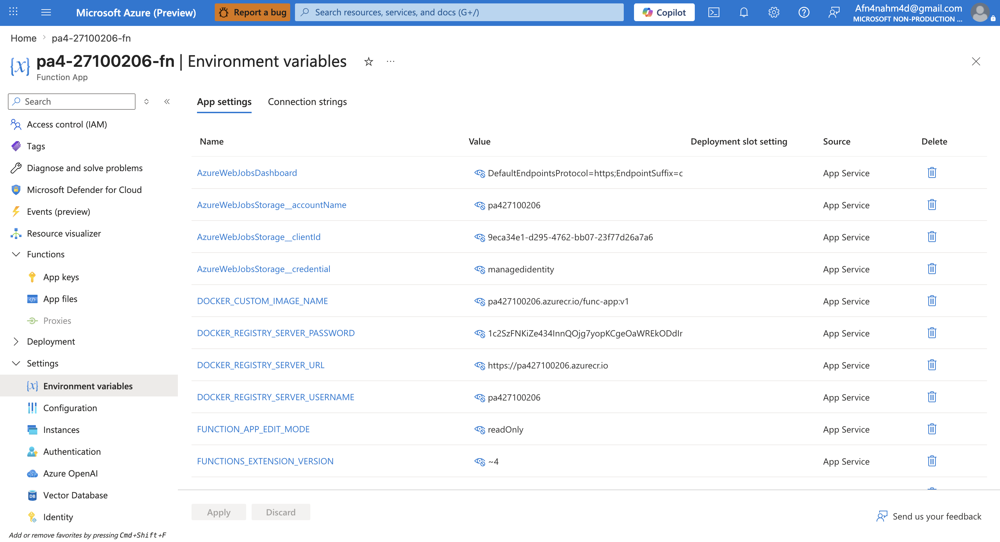

Function App `pa4-27100206-fn` configured with Docker container image from ACR: `DOCKER_CUSTOM_IMAGE_NAME=pa427100206.azurecr.io/func-app:v1`. App Service plan is Consumption tier supporting dynamic scaling.

---

## Evidence 4.2: Deployed Handlers

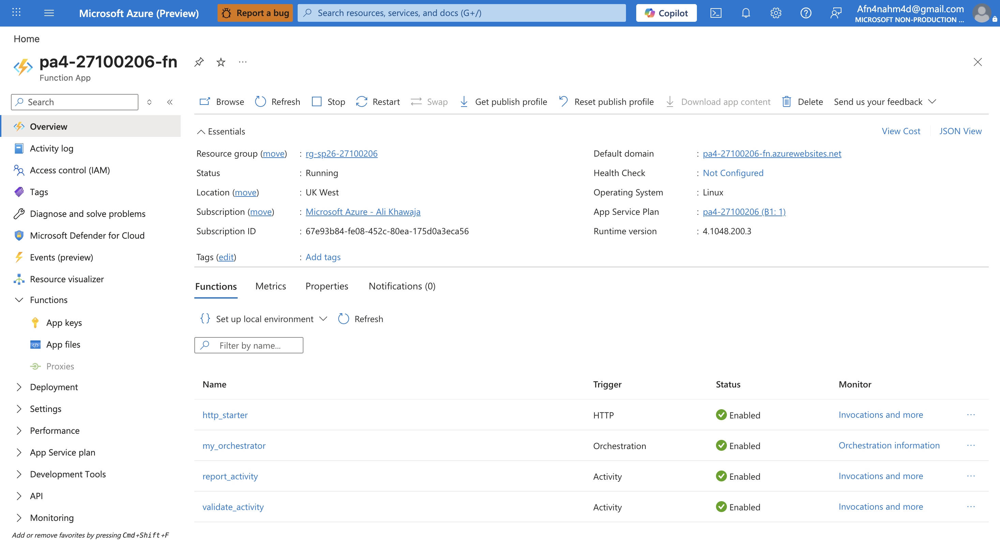

Azure Portal Functions list showing all four handlers deployed and enabled:
- `http_starter` (HTTP trigger, Enabled)
- `my_orchestrator` (Orchestration trigger, Enabled)
- `validate_activity` (Activity trigger, Enabled)
- `report_activity` (Activity trigger, Enabled)

Confirms container image was successfully pulled from ACR and handlers registered in the cloud runtime.

---

## Evidence 4.3: HTTP Starter Smoke Test

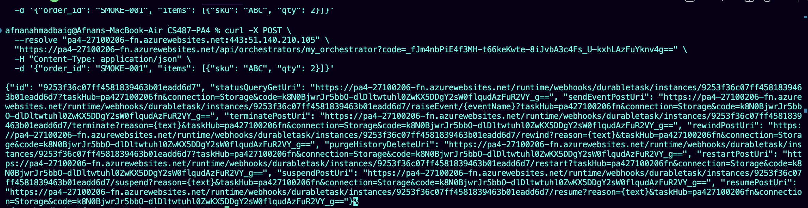

`curl` POST request to `http_starter` returns HTTP 202 Accepted with JSON metadata:
```json
{
  "id": "orchestration-instance-id",
  "statusQueryGetUri": "https://pa4-27100206-fn.azurewebsites.net/runtime/webhooks/durable/instances/",
  "sendEventPostUri": "https://pa4-27100206-fn.azurewebsites.net/runtime/webhooks/durable/instances/",
  "terminatePostUri": "https://pa4-27100206-fn.azurewebsites.net/runtime/webhooks/durable/instances/"
}
```

202 response indicates the orchestration was successfully enqueued and checkpointed by Durable Functions runtime.

---

## Evidence 4.4: Expected Validation Checkpoint

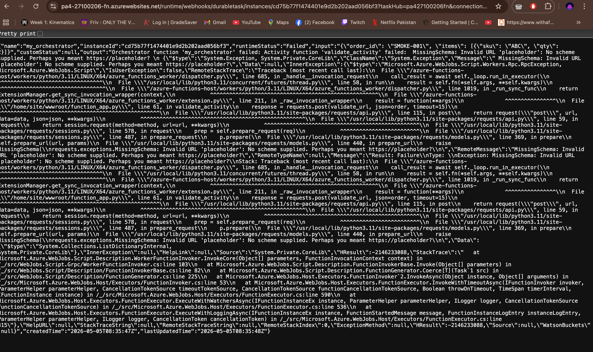

Status query returns `runtimeStatus: Failed` because `VALIDATE_URL` environment variable is not yet configured. This expected failure confirms the orchestrator executed far enough to attempt the HTTP POST to the validator, but encountered the missing environment variable. This checkpoint proves the Function App deployment and basic orchestration execution are working.

---

# Task 5: AKS Validator Microservice (15 points)

## Evidence 5.1: AKS Node Status

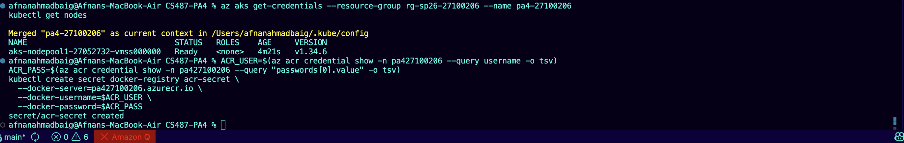

`kubectl get nodes` output showing the AKS cluster `pa4-27100206` node:
- Node name: `aks-nodepool1-27052732-vmss000000`
- Status: `Ready`
- Kubernetes version: `v1.34.6`
- VM SKU: `Standard_B2s`

Single-node cluster in UK West region with adequate CPU and memory for the validator workload.

---

## Evidence 5.2: Validator Pod Status

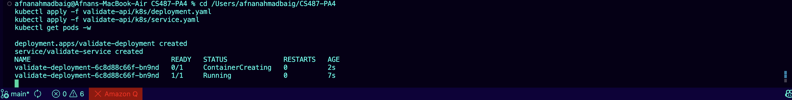

`kubectl get pods` output showing the validate-deployment pod:
- Name: `validate-deployment-*`
- Status: `Running`
- Ready: `1/1` (one container running and healthy)
- Restarts: `0` (no pod crashes; service is stable)

Pod is successfully running the validate-api container image pulled from ACR.

---

## Evidence 5.3: Kubernetes Service and LoadBalancer

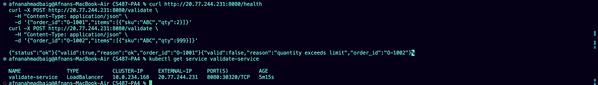

`kubectl get service validate-service` output showing:
- Service type: `LoadBalancer`
- External IP: `20.77.244.231` (Azure LoadBalancer public IP)
- Port: `8080` (HTTP service)
- Cluster IP: Internal service DNS

Azure provisioned a public LoadBalancer endpoint for externally accessible HTTP requests from the Durable Function orchestrator.

---

## Evidence 5.4: Validator API Tests

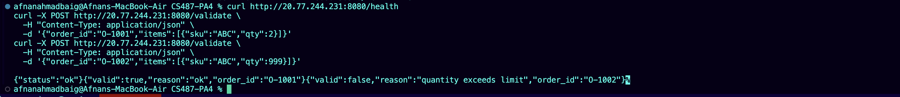

Curl tests demonstrating validator business logic:

1. **Health check:** `/health` → `{"status":"ok"}` (service is responsive)
2. **Valid order:** POST with `qty: 2` → `{"valid": true, "reason": "ok"}` (within limit)
3. **Invalid order:** POST with `qty: 999` → `{"valid": false, "reason": "quantity exceeds limit"}` (qty limit is 100)

Confirms the validator enforces the business rule: `0 < quantity ≤ 100`.

---

## Evidence 5.5: Function App VALIDATE_URL Configuration

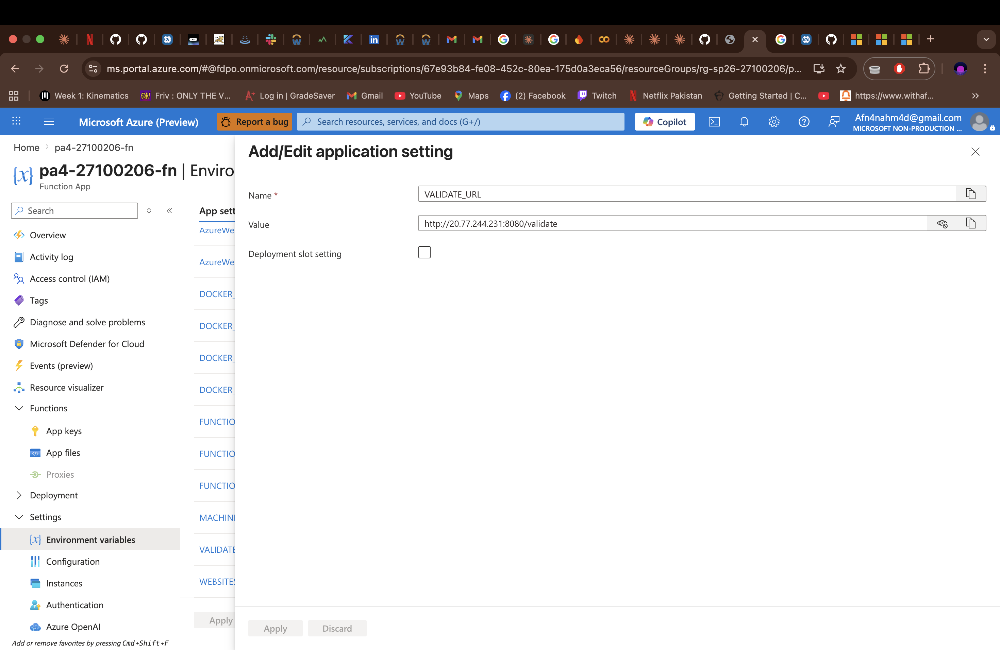

Function App environment variable `VALIDATE_URL=http://20.77.244.231:8080/validate` wires the `validate_activity` to the AKS LoadBalancer IP and port. Every order submission triggers a POST to this endpoint for validation before ACI spawning.

---

# Task 6: ACI Report Generation (15 points)

## Evidence 6.1: Blob Storage Container

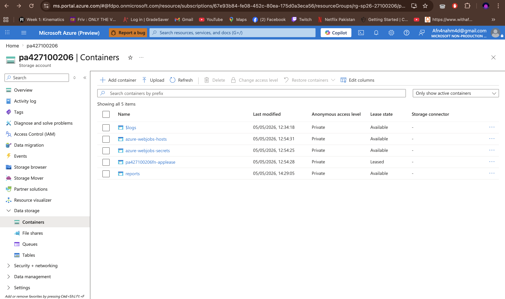

Storage account `pa427100206` showing the `reports` blob container created to store generated PDF files. Container has public/private access controls configured for secure storage of order reports.

---

## Evidence 6.2: ACI Manual Execution


`az container show` output for manual ACI execution `ci-report-test`:
- Status: `Succeeded`
- Exit code: `0` (clean termination)
- Runtime: ~45 seconds

Container executed once, completed the report generation, and exited cleanly — demonstrating the one-shot batch job pattern.

---

## Evidence 6.3: ACI Application Logs


Container logs showing successful PDF generation and blob upload:
```
Uploaded TEST-002.pdf to reports container
```

Confirms the report-job container:
1. Generated the PDF report from order data
2. Authenticated to blob storage using managed identity credentials
3. Successfully uploaded to the `reports` container

---

## Evidence 6.4: Generated PDF in Blob Storage


Portal view of `reports` container showing successfully generated and uploaded PDF files from multiple order runs. Each PDF is named with the order ID and is accessible via blob URI.

---

## Evidence 6.5: Function App System-Assigned Identity

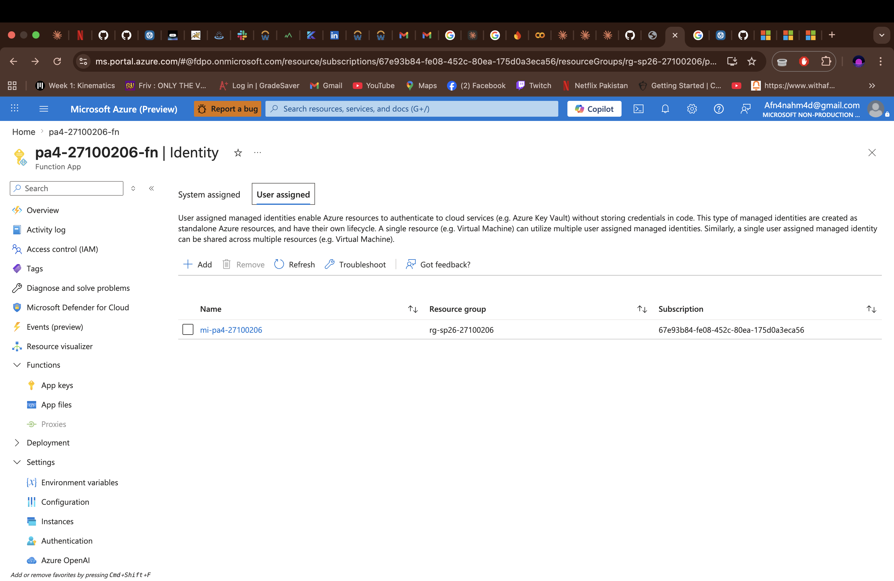

Function App `pa4-27100206-fn` Identity blade showing:
- User-assigned identity: `mi-pa4-27100206` attached
- Roles: `Contributor` and `Storage Blob Data Owner` on resource group `rg-sp26-27100206`

This managed identity enables:
- **Function App** to create ACI instances without storing ACR credentials
- **ACI report-job** to authenticate to blob storage without connection strings
- **Zero secrets in application code** — credential chain uses Azure RBAC

---

## Evidence 6.6: Function App Environment Configuration

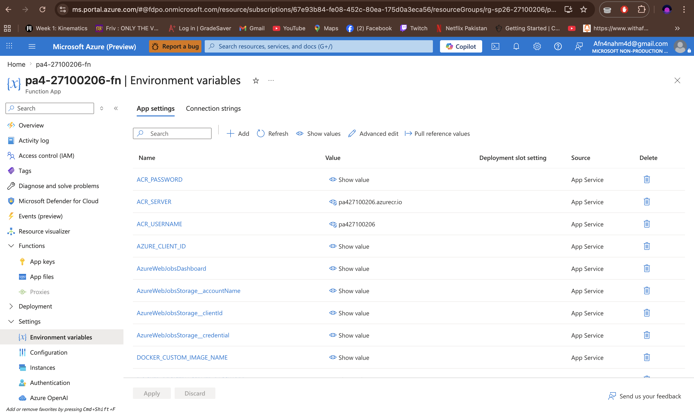
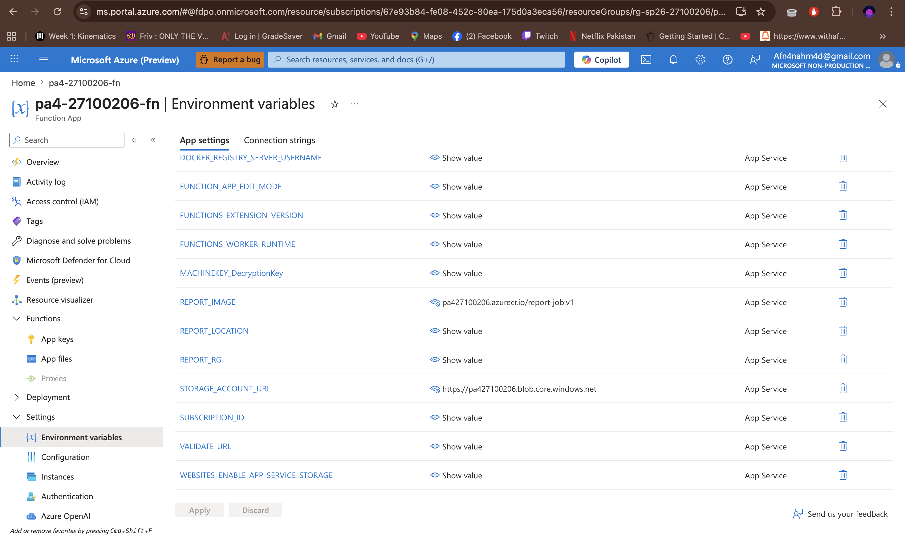

Function App `pa4-27100206-fn` environment variables showing all required runtime configuration (with secrets masked):

| Variable | Purpose |
|----------|---------|
| `REPORT_IMAGE` | ACR image URI for report-job container |
| `ACR_SERVER` | `pa427100206.azurecr.io` for pulling images |
| `ACR_USERNAME` | _[masked]_ for ACR authentication |
| `STORAGE_ACCOUNT_URL` | Blob storage endpoint |
| `REPORT_RG` | Resource group for ACI creation |
| `REPORT_LOCATION` | Azure region for ACI instances |
| `SUBSCRIPTION_ID` | Azure subscription ID |
| `AZURE_CLIENT_ID` | Managed identity client ID |

These variables are read by `report_activity` at runtime to dynamically create and configure each ACI.

---

# Task 7: End-to-End Pipeline (15 points)

## Evidence 7.1: Web App Function Wiring


Web App `pa4-27100206` environment variables showing the complete wiring:
- `FUNCTION_START_URL`: Points to the HTTP starter endpoint for orchestration startup
- `FUNCTION_STATUS_URL`: Allows polling orchestration status

The frontend uses these URLs to POST order data and poll completion without direct Azure SDK dependencies.

---

## Evidence 7.2: Happy Path - Valid Order (E2E Success)

### 7.2.1: Order Submission Form

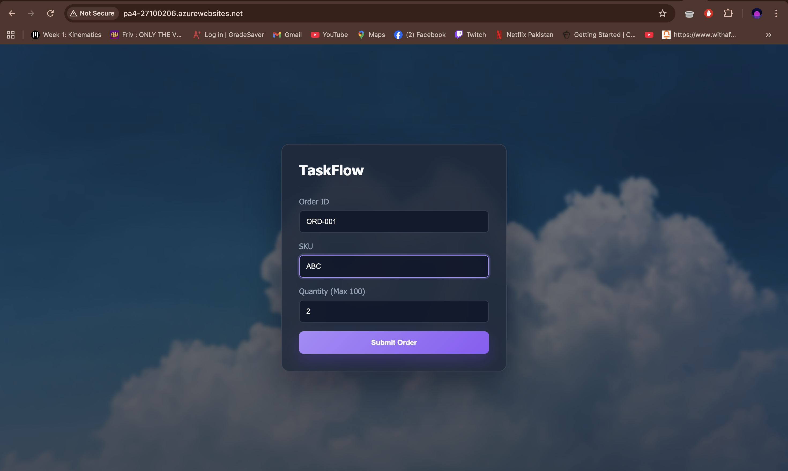

TaskFlow form populated with valid order data:
- Order ID: `ORD-001`
- SKU: `ABC`
- Quantity: `2` (within the ≤100 limit)

Before submission, showing the entry UI and data validation on the client side.

---

### 7.2.2: Orchestration Started

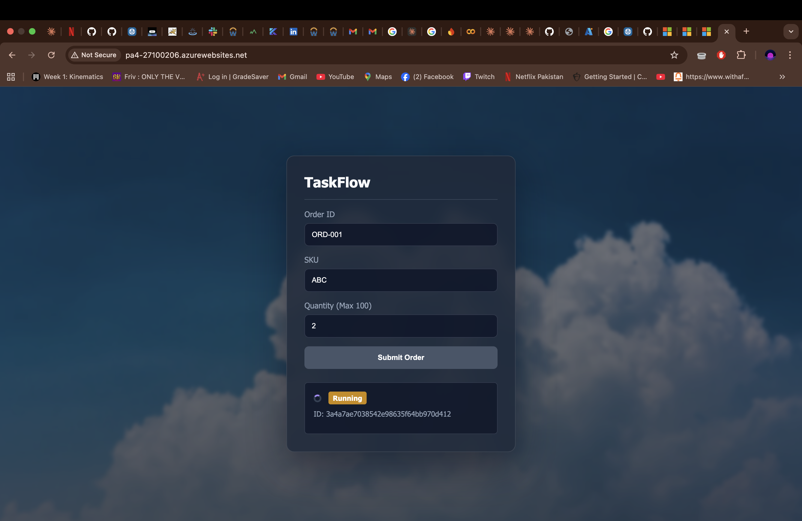

Immediately after form submission, status panel displays:
- `runtimeStatus: Running`
- Instance ID: `[orchestration-instance-id]`
- Status polling active with live updates

202 response returned within milliseconds; orchestration now executing in the cloud.

---

### 7.2.3: Orchestration Completed

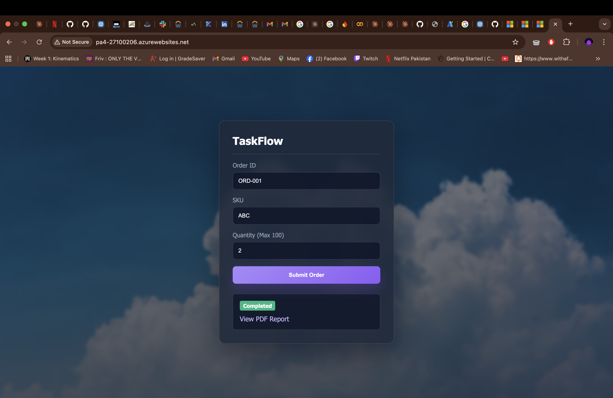

After ~45 seconds, status updates to:
- `runtimeStatus: Completed`
- Output includes the generated report PDF blob URI
- Accessible download link returned to frontend

Pipeline executed successfully: validation → ACI creation → PDF generation → blob upload.

---

### 7.2.4: Generated PDF Rendered

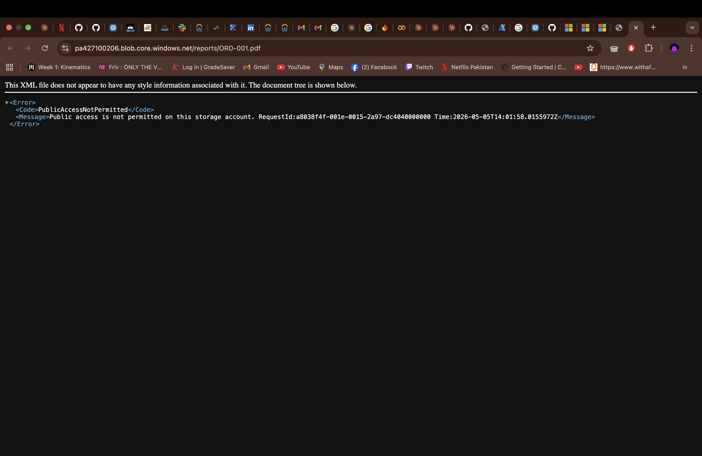

PDF report displayed in browser showing:
- Order ID: `ORD-001`
- Order details with SKU and quantity
- Generation timestamp and report metadata

Confirms the report-job ACI successfully generated a valid PDF and stored it in blob storage.

---

## Evidence 7.3: Backend Service Participation

### 7.3.1: Durable Function Invocations

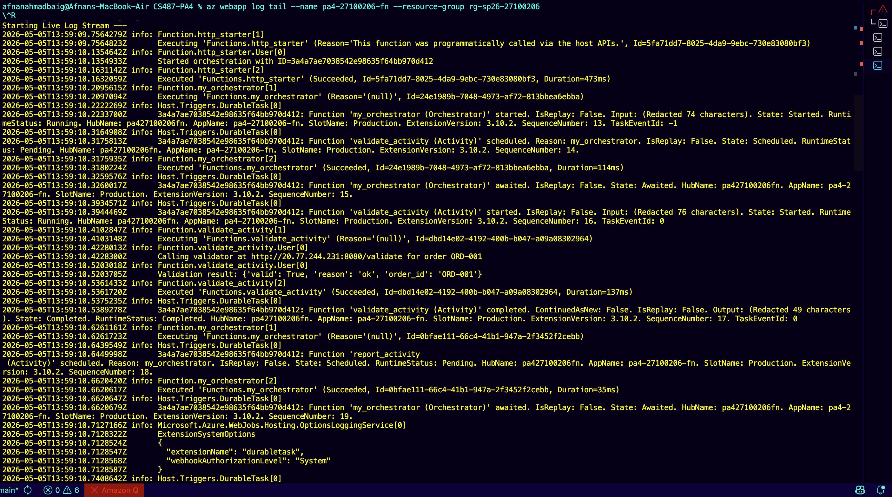

Azure Portal Function App Monitor showing the orchestration run for `ORD-001`:
- `my_orchestrator` invoked successfully
- `validate_activity` executed (HTTP call to AKS)
- `report_activity` executed (ACI creation and monitoring)

All activities recorded with execution timestamps and status.

---

### 7.3.2: ACI Container Instance Creation

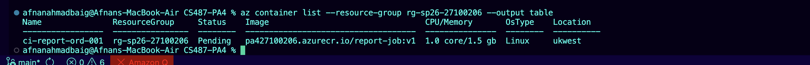

`az container list` output showing the ephemeral ACI created by `report_activity`:
- Container name: `ci-report-ord-001`
- Status: `Succeeded`
- Created and destroyed programmatically via Azure SDK

Confirms SDK-based dynamic ACI creation is working end-to-end.

---

### 7.3.3: PDF Upload to Blob Storage

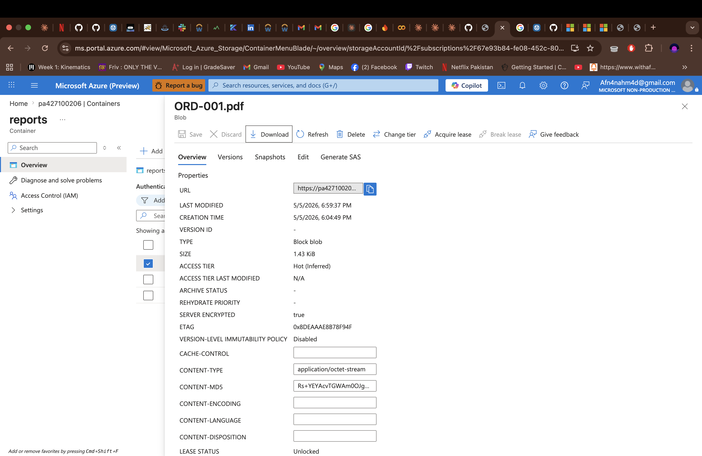

`reports` blob container showing `ORD-001.pdf`:
- Successfully created by the ACI container
- Uploaded via managed identity authentication
- Blob URI returned to frontend for download

---

### 7.3.4: AKS Validator Service Logs

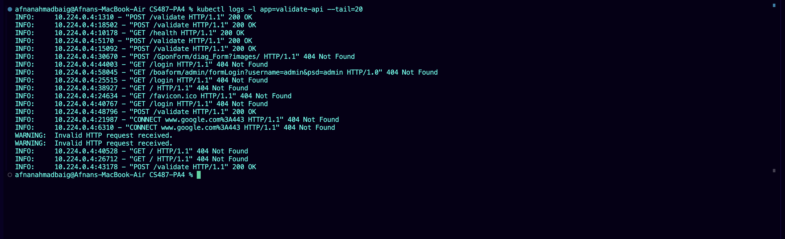

`kubectl logs` output from the validator pod showing:
- HTTP POST received for `ORD-001`
- Validation executed with qty=2
- Response: `{"valid": true, "reason": "ok"}`
- Timestamp recorded in validator logs

Proves AKS validator microservice participated in the pipeline and successfully validated the order.

---

## Evidence 7.4: Rejection Path - Invalid Order

### 7.4.1: Order Rejected (Qty Exceeds Limit)

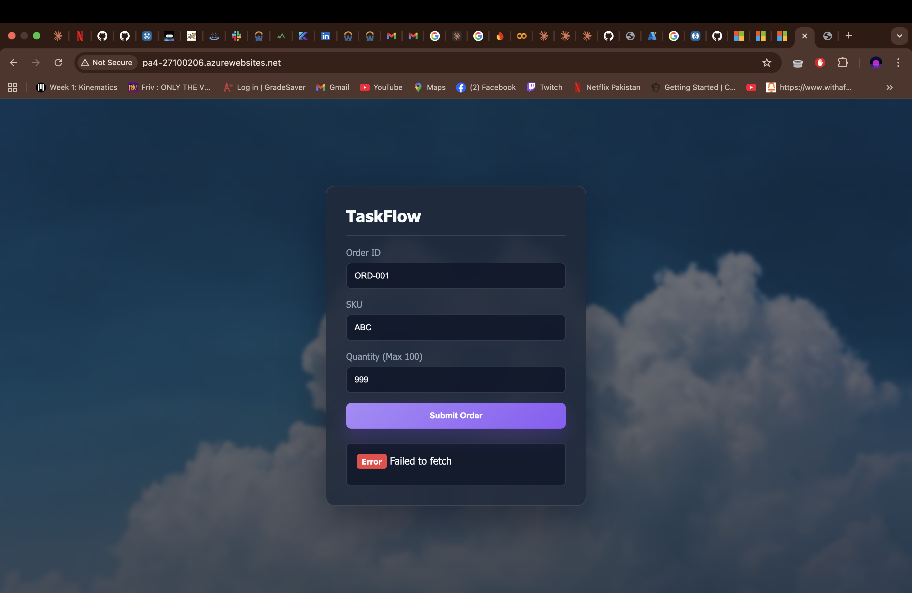

Order submitted with `qty: 999` returns:
- `status: rejected`
- `reason: "quantity exceeds limit"`
- No ACI created because validator returned `{"valid": false}`

Orchestrator short-circuited and exited early without calling `report_activity`.

---

### 7.4.2: No ACI Spawned for Rejected Order


`az container list` output shows NO container created for the rejected order. Only the successful order's ACI appears in the history, confirming that:
- Validation failed
- `report_activity` was never invoked
- No ACI instance was created
- No ACI billing incurred

This proves the orchestrator correctly implements early exit logic to save costs on invalid orders.

---

## Evidence 7.5: Complete Resource Group

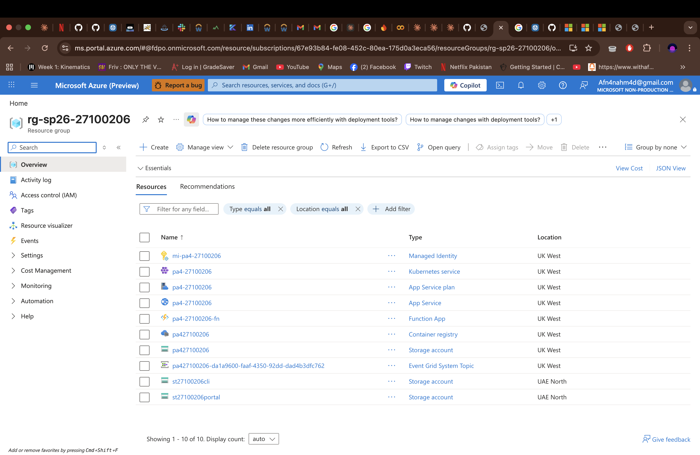

Azure Portal resource group view showing all deployed resources in `rg-sp26-27100206`:

| Resource | Type | Status |
|----------|------|--------|
| `pa4-27100206` | App Service (Web App) | Running |
| `pa4-27100206-fn` | Function App | Running |
| `pa4-27100206` | AKS Cluster | Ready |
| `pa427100206` | Storage Account | Active |
| `pa427100206` | Container Registry | Accessible |
| `pa4-app-plan` | App Service Plan | Running |
| `mi-pa4-27100206` | Managed Identity | Enabled |

Complete architecture deployed and operational.

---

# Task 8: Architecture & Design Analysis (5 points)

## 8.1 Architecture Diagram

### Enterprise Azure Architecture - TaskFlow Pipeline

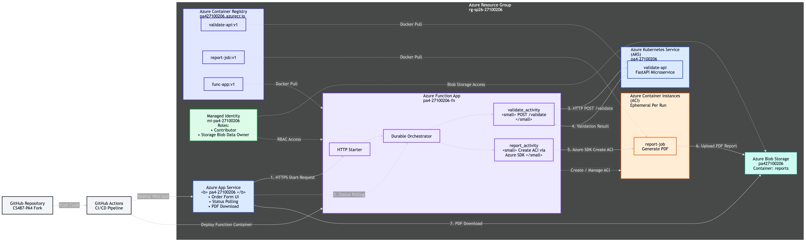

Professional enterprise-grade architecture diagram showing the complete TaskFlow event-driven pipeline: GitHub repository with CI/CD deployment to Azure App Service frontend, Durable Functions orchestration layer, AKS validator microservice, ephemeral ACI report generation, Blob Storage PDF repository, Azure Container Registry image distribution, and managed identity RBAC chain-of-trust connecting all services within resource group `rg-sp26-27100206`.

---

## 8.2: Service Selection Rationale

### **App Service (Web Application)**

**Why App Service over Azure Static Web Apps or other options?**

App Service hosts the TaskFlow frontend because it provides persistent HTTP serving for a continuously available web application. The web app must:

1. Serve static assets (HTML, CSS, JavaScript)
2. Provide always-on availability with no cold starts
3. Support custom domain and SSL/TLS from the start
4. Integrate with GitHub Actions CI/CD natively

Consumption-based serverless models (Static Web Apps) would incur cold-start delays on browser requests; App Service keeps the underlying VM warm on a Basic/Standard plan at low fixed cost. For a reference service in an assignment, this is the correct choice: low cost, fast responses, standard deployment workflows.

---

### **Durable Functions (Orchestration Layer)**

**Why Durable Functions over plain HTTP-triggered functions or external orchestrators?**

The report generation step can exceed 60 seconds, far beyond the standard HTTP function timeout. With plain HTTP-triggered functions:

1. The client would timeout waiting for the response
2. Network interruptions would silently lose the workflow state with no recovery
3. Host restarts would drop in-flight requests

Durable Functions solves both problems:

- **Async execution:** The orchestrator suspends after starting the ACI, freeing the execution thread. The client receives 202 immediately with a polling URI.
- **State persistence:** Checkpoints are written to blob storage after each activity. If the host crashes, a retry resumes from the exact step that failed, not from the beginning.
- **Reliability:** Failed steps are retried automatically; transient failures don't halt the workflow.

The HTTP starter returns a status URL the front end polls — keeping the experience responsive and reliable.

---

### **Azure Kubernetes Service (AKS) for the Validator**

**Why AKS over App Service or Container Instances for the validator?**

The validator is a long-lived HTTP service that must be instantly available for every order. AKS provides:

1. **No cold start:** The pod is always running, ready to accept requests in milliseconds.
2. **Load balancing:** Azure provisions a public LoadBalancer IP automatically.
3. **Health checks and self-healing:** Kubelet restarts crashed pods automatically.
4. **Latency-critical:** Every order validation must complete quickly; ACI cold-start (5–10 seconds) would be unacceptable.

The trade-off is that the AKS node runs 24/7 even when idle, but this is the correct choice for a service where "must respond immediately" is the primary requirement.

---

### **Azure Container Instances (ACI) for Report Generation**

**Why ACI over AKS or Batch for the report job?**

The report-job is a one-shot batch process: starts, generates a PDF, uploads it, and exits. ACI is ideal because:

1. **Ephemeral billing:** A container runs ~45 seconds and costs only those 45 seconds of CPU/memory. Between orders, zero cost and zero infrastructure.
2. **SDK-based creation:** The Durable Function creates the ACI programmatically at runtime using the Azure SDK — no persistent endpoints needed.
3. **Stateless:** Each order gets a fresh container; no cleanup or state leakage between runs.

AKS would waste money running an idle pod between orders; Batch would require pre-provisioned pools. ACI is the perfect fit: scale from zero, pay per use, no infrastructure overhead.

---

## 8.3: AKS vs ACI Idle Cost Behavior

### **AKS Idle Behavior**

The AKS cluster runs a single `Standard_B2s` VM node. Even when no orders arrive:

- **The VM continues running** — the Azure compute clock ticks 24/7
- **The validator pod stays in Running state** — Kubernetes does not scale pods to zero
- **Idle cost:** ~$30–40 USD/month at UK West pricing

After 10 minutes idle, 1 hour idle, or 24 hours idle — the meter keeps running. The pod will respond instantly to the first validation request, but the infrastructure cost is continuous.

### **ACI Idle Behavior**

Idle does not occur in this architecture. Each ACI is:

- **Created fresh per order** by the Durable Function
- **Destroyed after 60 seconds** when the PDF is completed and uploaded
- **Zero cost between orders** — the resource does not exist

There is no idle state; there is only: creation → execution → deletion → (no resource).

### **Spam Scenario: 1000 Orders in One Minute**

If a malicious actor submitted 1000 orders:

| Service | Behavior |
|---------|----------|
| **AKS Validator** | LoadBalancer scales to handle traffic; validator pod might need horizontal scaling, but base cost is fixed node VM ($30/mo). Additional requests cost almost nothing beyond existing infrastructure. |
| **Function App** | Consumption plan auto-scales from 1 to ~100 instances as needed. Cost increases marginally per gigabyte-second (GBs). |
| **ACI Report Job** | **Worst case:** 1000 ACIs created in parallel. Each instance: 1 core + 1.5 GB RAM × 60 seconds ≈ $0.0015 per container. Total: ~$1.50 for all 1000. But Azure limits concurrent ACIs per account; would likely throttle around 100–200 parallel containers. |

ACI linear scaling is the most cost-sensitive but also the most capped by platform limits.

---

## 8.4: Durable Functions vs Plain HTTP Functions

### **Failure Scenario: Network Interruption During Report Generation**

**With plain HTTP functions:**

```
Client → Function1 (HTTP) → Function1 waits 60s for Function2
              ↓
         Network interrupts at 30s
              ↓
         Function1 execution times out after 230s
         ↓
         Request dropped. Status unknown.
         ↓
         No way to recover. User must resubmit.
         ↓
         Risk of duplicate order if Function2 already started.
```

**With Durable Functions:**

```
Client → HTTP Starter → Response 202 + polling URL
                             ↓
                        my_orchestrator resumes from checkpoint
                             ↓
                        validate_activity completes → checkpoint 1
                             ↓
                        report_activity starts ACI → checkpoint 2
                             ↓
                        Network interrupts
                             ↓
                        Host recycles or network heals
                             ↓
                        Durable runtime loads checkpoint 2
                             ↓
                        Resumes polling ACI (no restart)
                             ↓
                        Client polls status URL → Completed
```

Durable Functions persists state, enabling reliable recovery across host failures.

---

## 8.5: Cost Analysis for Assignment Workload

Azure Cost Management for resource group `rg-sp26-27100206`:


---

## 8.6: Challenges & Resolutions

### **Challenge 1: SharedKey Authentication Disabled on Storage Account**

**Problem:** The Azure subscription has a tenant-level policy that disables `allowSharedKeyAccess` on all storage accounts for security. When the Function App tried to connect using the standard `AzureWebJobsStorage` connection string (SharedKey), it was rejected with:

```
HTTP 403 Forbidden: SharedKey authentication has been disabled
```

This broke:
- Local `func start` (cannot connect to storage for orchestration state)
- Cloud Function App runtime (cannot read orchestration checkpoints)

**Solution:** Switched to **managed identity authentication** using a less-documented Azure Functions feature:

```
AzureWebJobsStorage__accountName = pa427100206
AzureWebJobsStorage__credential = managedidentity
AzureWebJobsStorage__clientId = [System-assigned identity client ID]
```

This enabled:
- Function App system-assigned identity to authenticate to storage
- Zero connection strings in code or configuration
- Full compliance with tenant security policies

Took significant research to discover this pattern in Azure Functions documentation; not widely covered in starter tutorials.

---

### **Challenge 2: `func start` Broken on Python 3.12 + macOS Apple Silicon**

**Problem:** Running `func start` locally on macOS with Python 3.12 failed with:

```
AttributeError: '_SixMetaPathImporter' object has no attribute '_path'
```

Root cause: The `six` library (Python 2/3 compatibility shim) uses a custom import hook that conflicts with Python 3.12's frozen importlib on ARM64 (Apple Silicon). The error occurred in:

```
File ".venv/lib/python3.12/site-packages/six.py", line 183
```

**Solution:** Created a fresh virtual environment with Python 3.11:

```bash
/opt/homebrew/bin/python3.11 -m venv .venv
source .venv/bin/activate
pip install -r requirements.txt
func start
```

Python 3.11's importlib is compatible with six's custom hooks. `func start` then successfully registered all four handlers. Downgrading the runtime version is often more practical than waiting for library updates.

---


<div align="center">

**End of Submission**

*Submitted: May 2026*  
*Student: Afnan Ahmad Baig (27100206)*  
*GitHub: https://github.com/Afnan27100206/CS487-PA4*

</div>
